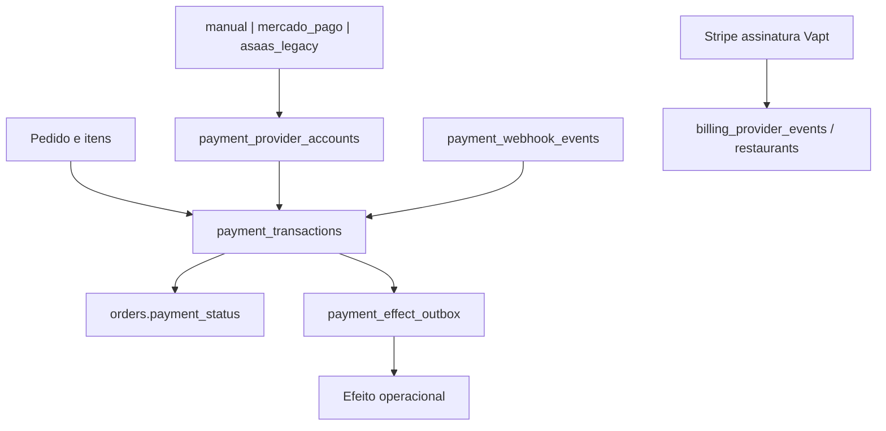

# Arquitetura de pagamentos V2

## Objetivos

- o servidor calcula o valor de cada pedido a partir do cardapio persistido.
- pagamentos manuais funcionam sem dependencia de provider externo.
- providers online implementam um contrato comum e capacidades explicitas.
- eventos financeiros e efeitos operacionais sao separados, auditaveis e reprocessaveis.
- Stripe de assinatura permanece fora do dominio de pagamentos de pedidos.
- Asaas opera como legado durante a janela de compatibilidade.

## Limites de dominio



`payment_transactions` e a fonte de verdade financeira detalhada. `orders.payment_status` e apenas um resumo operacional derivado, nunca a evidencia primaria de liquidacao.

## Tipos de provider e meios manuais

```ts
export type PaymentProviderCode = "manual" | "mercado_pago" | "asaas_legacy";

export type ManualPaymentMethod =
  | "cash"
  | "external_pix"
  | "credit_card"
  | "debit_card"
  | "voucher"
  | "other";
```

Stripe nao integra `PaymentProviderCode`, pois cobra a assinatura do Vapt e nao pedidos dos restaurantes.

## Estado financeiro normalizado

```text
created
  -> pending
  -> processing
  -> paid
  -> failed
  -> cancelled
  -> refunded
```

Transicoes permitidas:

| Origem | Destinos permitidos |
| --- | --- |
| `created` | `pending`, `processing`, `paid`, `failed`, `cancelled` |
| `pending` | `processing`, `paid`, `failed`, `cancelled` |
| `processing` | `pending`, `paid`, `failed`, `cancelled` |
| `paid` | `refunded` |
| `failed` | nenhum; nova tentativa cria nova transacao |
| `cancelled` | nenhum |
| `refunded` | nenhum na V1 |

Regras:

- pagamento manual pode ir de `created` diretamente para `paid` mediante ator autorizado.
- estorno parcial nao existe na V1; `partialRefunds` e `false`.
- eventos fora de ordem nao podem regredir `paid`, `cancelled` ou `refunded`.
- mudanca terminal exige compare-and-set ou RPC atomica com estado/versao esperados.
- uma nova tentativa de pagamento cria outra transacao ligada ao mesmo pedido.

## Estado operacional do pedido

O estado operacional continua separado:

```text
pending ou waiting_payment
  -> paid
  -> preparing
  -> ready
  -> out_for_delivery (somente delivery)
  -> delivered
```

`cancelled` e terminal. Pedidos de comanda aberta podem entrar em `pending` antes de pagamento; pedidos prepagos permanecem em `waiting_payment` ate a transacao ficar `paid`.

O mapeamento entre os dominios e configuravel por canal/modo, mas nunca ocorre por escrita direta do provider em varias telas.

## Politica de efeitos

Confirmacao financeira e efeito operacional sao etapas distintas:

1. validar autenticacao, tenant, moeda, valor e identificadores.
2. aplicar transicao financeira e resumo do pedido atomicamente.
3. inserir efeitos unicos na outbox na mesma transacao de banco.
4. responder ao webhook sem esperar trabalho nao essencial.
5. worker consome outbox com lease, retentativa e limite.
6. cada consumidor grava conclusao por `(payment_transaction_id, effect_type)`.

Efeitos iniciais:

- `release_order_to_kitchen`
- `record_cashier_revenue`
- `notify_order_paid`
- `reconcile_operational_summary`

Um efeito deve ser seguro para reexecucao. Falha em notificacao nao reverte pagamento. Falha ao liberar cozinha permanece visivel e reprocessavel.

## Contrato de provider

```ts
export interface PaymentProvider {
  readonly code: PaymentProviderCode;
  getCapabilities(): PaymentProviderCapabilities;
  createPayment(input: CreatePaymentInput): Promise<CreatePaymentResult>;
  getPaymentStatus(input: GetPaymentStatusInput): Promise<NormalizedPayment>;
  cancelPayment?(input: CancelPaymentInput): Promise<CancelPaymentResult>;
  refundPayment?(input: RefundPaymentInput): Promise<RefundPaymentResult>;
  handleWebhook?(input: ProviderWebhookInput): Promise<NormalizedPaymentEvent>;
}
```

Capacidades sao declaradas, nao inferidas:

```ts
type PaymentProviderCapabilities = {
  onlineCheckout: boolean;
  webhooks: boolean;
  cancellation: boolean;
  fullRefunds: boolean;
  partialRefunds: false;
  oauthConnection: boolean;
};
```

O service de dominio nao contem condicionais por nome de provider. O registry resolve o adapter por restaurante e valida capacidades.

## Criacao autoritativa de pedido

O cliente envia somente slug, canal, mesa quando aplicavel, IDs de itens/variacoes, quantidade, observacao e endereco de delivery. A API:

1. resolve restaurante por slug e valida canal ativo.
2. carrega itens e variacoes pertencentes ao mesmo restaurante.
3. rejeita item indisponivel, quantidade invalida e mistura de tenant.
4. calcula valores com numerica decimal no servidor.
5. cria pedido e itens atomicamente.
6. retorna total calculado e token publico opaco para consultar aquele pedido.

Campos enviados pelo cliente como preco, total, status, `restaurantId` ou estado financeiro sao rejeitados ou ignorados conforme o contrato de validacao.

## Modelo de dados alvo

### `payment_provider_accounts`

Uma conta/provider por restaurante e ambiente, com status, capacidades e credenciais cifradas. Sem grants diretos a `anon` ou `authenticated`.

### `payment_transactions`

Uma tentativa financeira imutavelmente ligada a pedido/restaurante. Inclui valor, moeda, status normalizado, metodo, modo, idempotency key, IDs externos, versao e timestamps.

Constraints essenciais:

- `amount > 0`
- moeda ISO em tres letras maiusculas
- unique `(provider, external_payment_id)` quando ID existir
- unique `(restaurant_id, idempotency_key)`
- FKs e tenant coerentes

### `payment_webhook_events`

Reserva eventos externos por `(provider, external_event_id)`, mantem payload bruto, resultado de validacao, tentativas e erro. Evento desconhecido permanece auditavel sem alterar pedido.

### `payment_oauth_states`

`state` de uso unico, hash/PKCE, restaurante, expiracao e consumo. Nao armazena segredo no navegador.

### `payment_effect_outbox`

Efeitos unicos por `(payment_transaction_id, effect_type)`, com status, tentativas, proxima execucao, lease e erro.

## Seguranca de credenciais

Tokens OAuth sao armazenados em envelope AES-256-GCM versionado:

```text
version | key_id | iv | ciphertext | auth_tag
```

Regras:

- chave mestra apenas no ambiente da API.
- uma data key derivada/gerenciada por versao; rotacao usa `key_id`.
- AAD inclui `restaurant_id`, provider, ambiente e ID da conta.
- IV aleatorio e unico por cifragem.
- service role e a unica identidade com acesso aos campos cifrados.
- logs, erros, analytics e responses nunca incluem token, code verifier ou client secret.
- refresh troca tokens sob lock/compare-and-set para evitar corrida.

## OAuth Mercado Pago

- Authorization Code para atuar em nome do vendedor.
- `state` aleatorio, opaco, de uso unico e com expiracao curta.
- PKCE S256 habilitado e `code_verifier` guardado no servidor.
- `redirect_uri` estatica e exatamente igual a configurada na aplicacao.
- callback troca `code` por tokens no backend.
- refresh token renova acesso sem nova interacao, com rotacao atomica.
- desconexao revoga/desativa a conta e impede novos checkouts.

## Checkout Pro

- uma preferencia e criada server-side para cada tentativa.
- itens e valor derivam do pedido persistido, nunca do body do browser.
- `external_reference` carrega identificador opaco/servidor para reconciliacao.
- retorno do navegador e apenas UX; nao confirma pagamento.
- webhook `payment` assinado aciona consulta a `/v1/payments/{id}` antes de transicao sensivel.
- conta coletora, ordem, moeda, valor e IDs precisam coincidir.

## Idempotencia e concorrencia

- criar checkout exige `Idempotency-Key` e unique por restaurante.
- mesma chave e mesmo payload retorna a mesma transacao/preferencia.
- mesma chave com payload diferente retorna conflito.
- webhook e reservado antes do processamento.
- duplicata processada retorna sucesso sem repetir efeito.
- falha transitoria permanece reprocessavel; worker e reconciliador consultam o provider sem criar nova cobranca.
- nunca executar dual write que crie duas cobrancas reais.

## Acesso publico e tenant

- paginas publicas usam view/RPC com campos estritamente publicos.
- pedido publico e consultado com token opaco cujo hash fica no banco.
- cliente nao recebe service role, credenciais de provider ou token de webhook.
- toda conta, transacao, evento e efeito valida `restaurant_id` comum.
- rotas administrativas passam pelo adapter de autorizacao da API.

## Compatibilidade e rollout

1. restringir superfícies publicas sensiveis.
2. adicionar schema V2 sem remover legado.
3. criar dominio e provider manual.
4. tornar pedidos autoritativos.
5. conectar Mercado Pago em sandbox.
6. ativar feature flag para um restaurante piloto.
7. reconciliar e observar.
8. impedir novas cobrancas Asaas.
9. manter leitura/webhook historico durante janela definida.
10. remover legado somente apos inventario final.

Rollback desliga provider/flag V2 e volta novos pedidos ao adapter legado, preservando todas as transacoes e eventos ja criados.

