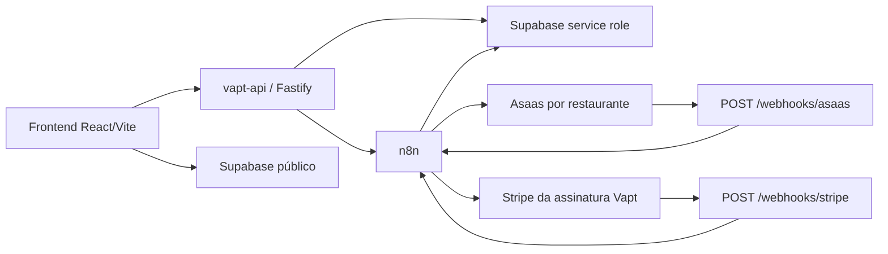

# Auditoria da refatoracao de pagamentos

Data de consolidacao: 25 de julho de 2026.

## Escopo e regra de preservacao

Este documento consolida o fluxo de pedidos, pagamentos, webhooks e assinaturas antes da introducao do modelo de providers V2. O inventario foi feito nos repositorios `vaptmesaflow` e `vapt-api`, nas migrations e nos workflows n8n versionados.

Durante a compatibilidade:

- Asaas continua atendendo pagamentos Pix de pedidos existentes.
- Stripe continua atendendo exclusivamente a assinatura SaaS do Vapt.
- n8n continua executando os workflows Asaas, Stripe e Ingest.
- nenhuma integracao classificada como indeterminada pode ser removida sem nova verificacao.
- novas estruturas devem ser aditivas e reversiveis por feature flag.

## Arquitetura atual



O limite arquitetural pretendido ja e `frontend -> vapt-api -> servicos internos`, mas o frontend ainda escreve pedidos e itens diretamente no Supabase. Esse caminho paralelo impede que a API seja a autoridade integral do valor e do estado financeiro.

## Fluxo atual de Pix Asaas

```text
OrderSummaryDrawer/PublicDelivery
-> insere orders e order_items diretamente no Supabase
-> envia orderId, restaurantId e totalPrice para vapt-api
-> POST /billing/asaas/pix ou /billing/asaas/pix/public
-> vapt-api valida forma do payload e, no caminho autenticado, ownership
-> vapt-api encaminha para n8n /asaas/pix/create
-> n8n carrega restaurante e pedido
-> n8n localiza/cria cliente generico no Asaas
-> n8n cria cobranca Pix e busca QR Code
-> n8n grava metadados no pedido e payment_provider_events
-> frontend exibe QR e consulta orders
-> Asaas envia webhook para vapt-api
-> vapt-api valida token armazenado, reserva evento gateway e encaminha ao n8n
-> n8n deduplica evento de provider e atualiza payment_status/status
-> Supabase Realtime alimenta menu, cozinha, caixa e overview
```

### Fragilidade de valor

- `orders.total_price` e `order_items.unit_price` nascem de inserts publicos feitos pelo navegador.
- a rota publica da API carrega o pedido, mas aceita `body.totalPrice` quando presente.
- a rota autenticada encaminha diretamente o `totalPrice` recebido.
- o n8n volta a carregar pedido e restaurante, mas a origem do valor persistido ja pode ter sido influenciada pelo cliente.

Conclusao: hoje nao existe uma fonte de verdade confiavel e exclusiva para o valor cobrado. A correcao exige criacao autoritativa do pedido no servidor usando produtos e precos atuais do banco.

## Fluxo atual de assinatura Stripe

```text
Dashboard de assinatura
-> vapt-api /billing/stripe/*
-> autorizacao por owner/restaurant
-> n8n /stripe/subscription/*
-> Stripe
-> webhook Stripe em vapt-api
-> validacao de stripe-signature
-> reserva em billing_provider_events como stripe_gateway
-> encaminhamento raw ao n8n
-> n8n registra evento de billing e atualiza restaurants
```

Classificacao: **assinatura do Vapt**. Esse fluxo nao deve entrar no dominio de pagamentos de pedidos nem ser removido durante a migracao do Asaas.

## Fluxos n8n inventariados

| Familia | Gatilho | Operacao | Persistencia | Indisponibilidade |
| --- | --- | --- | --- | --- |
| Asaas setup | `POST /asaas/setup` | valida chave, registra webhook e persiste configuracao | `restaurants` | restaurante nao habilita Pix |
| Asaas refresh | `POST /asaas/setup/refresh` | repete validacao e registro | `restaurants` | diagnostico/configuracao fica desatualizado |
| Asaas status | `GET /asaas/setup/status` | le configuracao | `restaurants` | painel nao informa saude |
| Asaas Pix | `POST /asaas/pix/create` | cliente generico, cobranca, QR e persistencia | `orders`, `payment_provider_events` | pedido pode existir sem cobranca |
| Asaas webhook | `POST /asaas/webhook` | confirma pagamento e altera pedido | `payment_provider_events`, `orders` | pagamento pode aprovar sem pedido avancar |
| Stripe assinatura | `/stripe/subscription/*` | cria, altera e cancela assinatura | `restaurants`, `billing_provider_events` | faturamento SaaS fica indisponivel |
| Stripe webhook | `POST /stripe/webhook` | reconcilia assinatura | `billing_provider_events`, `restaurants` | billing pode ficar divergente |
| Ingest | `/ingest/*` | push e feedback | tabelas operacionais | automacoes nao financeiras falham |

### Idempotencia e retentativas

- vapt-api reserva webhooks em `payment_provider_events` ou `billing_provider_events` usando providers `asaas_gateway` e `stripe_gateway`.
- n8n registra novamente eventos com providers proprios, criando duas camadas de deduplicacao intencionais, mas sem coordenacao transacional entre elas.
- falha ao encaminhar para n8n muda o envelope do evento gateway para `pending_retry`.
- nao foi encontrado worker periodico que consuma automaticamente `pending_retry`.
- o webhook Asaas usa `providerEventId = asaas:<orderId>:<eventType>`; eventos distintos do mesmo tipo para o mesmo pedido podem colidir mesmo quando o Asaas os considera eventos separados.

## Inventario Asaas

| Uso | Classificacao | Credencial | Efeito |
| --- | --- | --- | --- |
| configuracao por restaurante | pagamento de pedido | `restaurants.asaas_api_key` | valida conta e registra webhook |
| criacao de Pix | pagamento de pedido | chave do restaurante | cria cobranca e QR Code |
| webhook de pagamento | pagamento de pedido | `asaas_webhook_token` | confirma pedido e libera operacao |
| campos de ambiente/documento | pagamento de pedido | chave + CPF/CNPJ operacional | seleciona sandbox/producao e cliente generico |
| qualquer referencia Stripe | assinatura do Vapt | credenciais Stripe do Vapt | nao pertence ao Asaas de pedidos |

Dados historicos que precisam ser preservados: IDs de pagamento, payload/QR quando armazenados, `payment_status`, `payment_confirmed_at`, eventos de provider, ambiente, IDs e token do webhook e trilha temporal do pedido.

## Fonte de verdade atual

| Dado | Situacao atual | Risco |
| --- | --- | --- |
| itens e quantidades | carrinho do navegador, depois `order_items` | item/preco adulteravel antes da persistencia |
| total do pedido | calculado no frontend e gravado em `orders.total_price` | cobranca com valor indevido |
| status financeiro detalhado | dividido entre Asaas, evento e campos do pedido | divergencia sem reconciliacao automatica |
| resumo financeiro operacional | `orders.payment_status` | strings heterogeneas e sem constraint |
| confirmacao online | webhook Asaas via API e n8n | n8n indisponivel deixa evento pendente |
| assinatura SaaS | Stripe + `restaurants` + `billing_provider_events` | separado e deve permanecer assim |

## Efeitos observados apos pagamento

| Efeito | Gatilho atual | Responsavel | Idempotencia | Risco |
| --- | --- | --- | --- | --- |
| marcar pagamento | webhook Asaas relevante | n8n | evento unico + verificacao de patch | confirmacao nao aplicada se workflow falhar |
| liberar pedido prepaid | `orders.status = paid` e/ou `payment_status = CONFIRMED` | n8n e consumidores | parcial | estados equivalentes podem divergir |
| entrada na cozinha | query/realtime de `orders` | frontend KDS | lista por ID em memoria | refresh ou evento duplicado pode repetir sinal local |
| notificacao sonora | novo pedido confirmado no KDS | frontend KDS | memoria da sessao | nao e entrega garantida |
| caixa/overview | leitura de `orders` | frontend | leitura derivada | receita pode contar estado operacional, nao transacao financeira |
| fechamento em dinheiro | acao de caixa | frontend/Supabase | sem transacao financeira normalizada | auditoria financeira incompleta |

Nao foram encontrados efeitos implementados de baixa de estoque, emissao fiscal ou fidelidade ligados atomicamente a confirmacao de pagamento.

## Modelo de dados legado relevante

### `orders`

- `id`, `restaurant_id`, `table_session_id`, `table_number`, `display_id`
- `total_price`, `status`, `payment_status`
- `payment_confirmed_at` e metadados de provider adicionados por migrations posteriores
- realtime habilitado
- leitura e insert publicos amplos no schema atual

### `order_items`

- produto, nome, quantidade, preco unitario e observacao
- leitura e insert publicos amplos

### `restaurants`

- configuracao Asaas, ambiente, documento, webhook e erros
- identificadores e estado da assinatura Stripe
- policies historicas por slug podem expor a linha inteira, incluindo campos sensiveis

### Eventos

- `payment_provider_events`: eventos de pagamento de pedidos
- `billing_provider_events`: eventos de assinatura
- unique `(provider, provider_event_id)`
- payload inclui estado gateway e erro de encaminhamento

## Riscos prioritarios

1. **P0 - valor adulteravel:** navegador participa da determinacao de total e preco.
2. **P0 - dados sensiveis em superficie publica:** policies por slug e leitura de `restaurants` precisam ser substituidas por uma view/RPC publica minima.
3. **P1 - confirmacao sem efeito:** evento pode ficar `pending_retry` sem consumidor automatico.
4. **P1 - pagamento sem transacao normalizada:** o pedido pode ser marcado como pago sem uma entidade financeira completa.
5. **P1 - pedido sem cobranca:** pedido e itens sao persistidos antes da criacao do Pix.
6. **P1 - estados heterogeneos:** `CONFIRMED`, `RECEIVED_IN_CASH`, `paid` e outros valores misturam financeiro e operacao.
7. **P2 - duas idempotencias:** API e n8n reservam eventos separadamente, sem unidade atomica.
8. **P2 - display ID concorrente:** `MAX(display_id) + 1` pode colidir sob inserts simultaneos.

## Preservacao e adaptacao

### Manter

- Stripe de assinatura e seu webhook.
- n8n Ingest.
- adapter de autorizacao por restaurante na API.
- eventos historicos Asaas e Stripe.
- realtime operacional de pedidos, depois de restringir acesso publico.
- caminhos legados Asaas durante piloto e observacao.

### Adaptar

- criacao de pedidos para uma operacao atomica e autoritativa na API.
- `orders.payment_status` para resumo derivado.
- webhooks para evento normalizado, verificacao no provider e outbox.
- caixa e overview para ler transacoes financeiras quando apropriado.
- Asaas para adapter `asaas_legacy`, sem novas dependencias de dominio.

### Remocao futura condicionada

- tela e campos de configuracao Asaas para novos pedidos.
- rotas de novas cobrancas Asaas.
- branches Asaas do n8n.
- acesso publico direto a `orders`, `order_items` e linha completa de `restaurants`.

Nenhum item desta lista pode ser removido antes do piloto, reconciliacao e janela de compatibilidade.

## Lacunas que exigem verificacao operacional

- versao efetivamente publicada de cada workflow n8n comparada ao JSON versionado.
- cobrancas Asaas pendentes e webhooks ainda ativos em producao.
- colunas adicionais aplicadas manualmente no Supabase fora das migrations.
- formato historico de IDs/QR e volume de eventos ambiguos.
- dashboards ou automacoes externas que leem diretamente os campos legados.

## Inventario final da compatibilidade

O arquivo `docs/asaas-decommission-inventory.sql` transforma as principais lacunas
de dados em verificacoes somente leitura. Qualquer linha `BLOQUEADO` mantem ativos:

- `POST /webhooks/asaas` na API;
- o encaminhamento `asaas/webhook` no n8n;
- os tokens por restaurante usados para validar eventos historicos.

O inventario nao autoriza apagar historico. Mesmo depois de todas as verificacoes
retornarem `OK`, a retirada deve ocorrer em duas entregas reversiveis: primeiro o
receptor/encaminhamento; depois, em outra janela, credenciais e colunas legadas.
